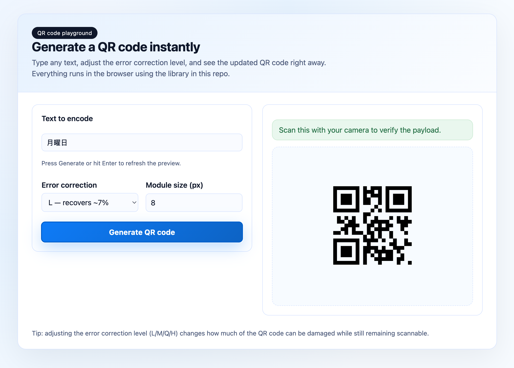
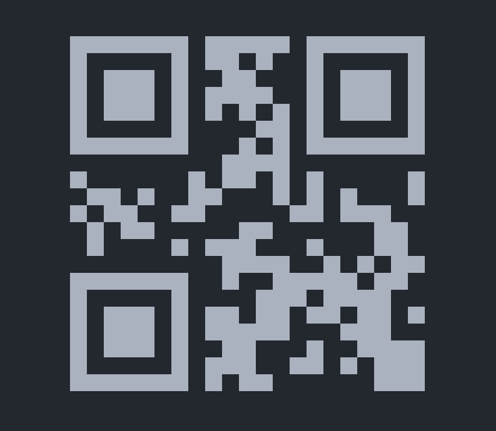

# QR Code Generator

A robust, zero-dependency, highly configurable QR code generator for TypeScript and JavaScript projects. This library implements the complete QR Code specification (ISO/IEC 18004) with support for all versions (1-40), error correction levels, and encoding modes.

## Features

- **Complete QR Code Implementation**: Full support for QR Code versions 1-40 with automatic version selection
- **All Encoding Modes**: Numeric, Alphanumeric, Byte, and Kanji encoding with automatic mode detection
- **Error Correction Levels**: L (7%), M (15%), Q (25%), H (30%) with configurable levels
- **SVG Rendering**: Built-in SVG renderer with customizable module size
- **Zero Dependencies**: Pure TypeScript implementation with no external dependencies
- **Full TypeScript Support**: Complete type safety and IntelliSense support
- **Comprehensive Testing**: Full unit test suite with Reed-Solomon error correction validation
- **Browser & Node.js**: Works in both environments with ESM, CJS, and UMD builds

## Installation

```bash
npm install qr-code-gen
```

## Quick Start

```typescript
import { generateQRCode, renderToSVG } from 'qr-code-gen';

// Generate a QR code
const matrix = generateQRCode({ data: 'Hello, World!' });

// Render as SVG (size in pixels)
const svg = renderToSVG(matrix, 300);

console.log(svg);
```

## API Reference

### `generateQRCode(config)`

Generates a QR code matrix.

#### Parameters

- `config.data` (string): The data to encode
- `config.version?` (number): QR code version (1-40, auto-detected if not specified)
- `config.ecl?` ('L' | 'M' | 'Q' | 'H'): Error correction level (default: 'M')
- `config.mode?` ('Numeric' | 'Alphanumeric' | 'Byte' | 'Kanji' | 'Auto'): Encoding mode (default: 'Auto')
- `config.quietZone?` (number): Quiet zone size in modules (default: 4)

#### Returns

- `QRMatrix`: 2D boolean array where `true` represents black modules

### `renderToSVG(matrix, size?)`

Renders a QR code matrix as an SVG string.

#### Parameters

- `matrix` (QRMatrix): The QR code matrix from `generateQRCode`
- `size?` (number): Total SVG size in pixels (default: 300)

#### Returns

- `string`: SVG markup

### `renderToString(matrix)`

Renders a QR code matrix as a UTF-8 string using block characters (useful for console output).

#### Parameters

- `matrix` (QRMatrix): The QR code matrix from `generateQRCode`

#### Returns

- `string`: Console-friendly string representation

## Examples

### Basic Usage

```typescript
import { generateQRCode, renderToSVG } from 'qr-code-gen';

// Simple text QR code
const matrix = generateQRCode({ data: 'https://example.com' });
const svg = renderToSVG(matrix, 300);
```

### Advanced Configuration

```typescript
import { generateQRCode, renderToSVG } from 'qr-code-gen';

// High error correction with custom sizing
const matrix = generateQRCode({
    data: 'Important data that needs redundancy',
    ecl: 'H', // High error correction (30% recovery)
    version: 10, // Force specific version
    quietZone: 2 // Smaller quiet zone
});

const svg = renderToSVG(matrix, 400); // 400px SVG
```

### Console Output

```typescript
import { generateQRCode, renderToString } from 'qr-code-gen';

const matrix = generateQRCode({ data: 'Hello, World!' });
console.log(renderToString(matrix));
```

### Different Encoding Modes

```typescript
import { generateQRCode } from 'qr-code-gen';

// Numeric mode (most efficient for numbers)
const numericQR = generateQRCode({
    data: '1234567890',
    mode: 'Numeric'
});

// Alphanumeric mode
const alphaQR = generateQRCode({
    data: 'ABC123',
    mode: 'Alphanumeric'
});

// Byte mode (for any data)
const byteQR = generateQRCode({
    data: 'Hello, 世界!',
    mode: 'Byte'
});

// Kanji mode (for Japanese text)
const kanjiQR = generateQRCode({
    data: 'こんにちは',
    mode: 'Kanji'
});
```

## QR Code Specifications

This implementation follows the official QR Code specification:

### Versions

- **Versions 1-40**: Support for matrix sizes from 21×21 to 177×177 modules
- **Auto-detection**: Automatically selects the minimum version required for your data

### Error Correction Levels

| Level | Error Correction Capacity | Data Recovery |
|-------|---------------------------|---------------|
| L     | ~7%                       | Low           |
| M     | ~15%                      | Medium        |
| Q     | ~25%                      | Quartile      |
| H     | ~30%                      | High          |

### Encoding Modes

| Mode       | Character Set                    | Bits per Character |
|------------|----------------------------------|--------------------|
| Numeric    | 0-9                             | 3.33               |
| Alphanumeric| 0-9, A-Z, and 9 special chars | 5.5                |
| Byte       | ISO-8859-1 characters           | 8                  |
| Kanji      | Shift JIS characters             | 13                 |

## Implementation Details

### Architecture

The library is organized into several modules:

- **`/encoder`**: Data encoding and mode selection
- **`/ecc`**: Reed-Solomon error correction
- **`/matrix`**: Matrix initialization and pattern placement
- **`/renderers`**: Output formatting (SVG, console)
- **`/constants`**: QR code specification data

### Features Implemented

- ✅ All 40 QR code versions with correct capacity calculations
- ✅ Complete Reed-Solomon error correction implementation
- ✅ All encoding modes including Kanji support
- ✅ Proper alignment pattern placement for all versions
- ✅ Format and version information pattern reservation
- ✅ Masking pattern evaluation and selection
- ✅ Comprehensive unit test coverage

### Performance

- **Optimized for size**: Zero dependencies, minimal bundle size
- **Fast encoding**: Efficient bit manipulation and data structures
- **Memory efficient**: Streamlined matrix operations

## Interactive Demo

Try the QR code generator in your browser! The demo allows you to:

- Enter any text or URL
- Adjust error correction levels (L/M/Q/H)
- Customize module size
- See real-time QR code generation

Open `src/example/demo.html` in your browser to try it out.

### Browser Demo



### Console Output



## Development

### Building

```bash
npm run build
```

### Testing

```bash
npm test
```

### Linting

```bash
npm run lint
```

## Contributing

Contributions are welcome! Please ensure:

1. All tests pass (`npm test`)
2. Code follows the existing style (`npm run lint`)
3. New features include appropriate tests
4. Documentation is updated for any API changes

## License

MIT License - see LICENSE file for details.

## Changelog

See [CHANGELOG.md](./CHANGELOG.md) for a detailed history of changes.

## References

- [ISO/IEC 18004:2015 - QR Code Specification](https://www.iso.org/standard/62021.html)
- [Reed-Solomon Coding for Beginners](https://www.angelfire.com/planet/bytesal/rs/index.html)
